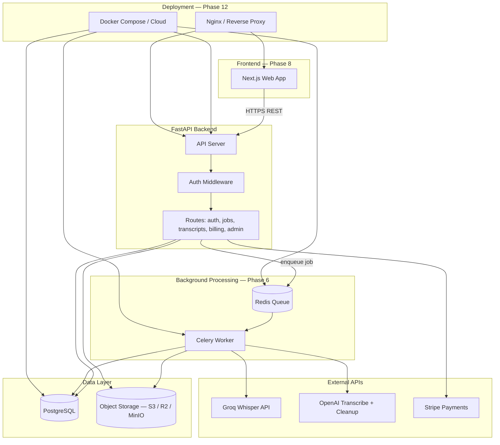
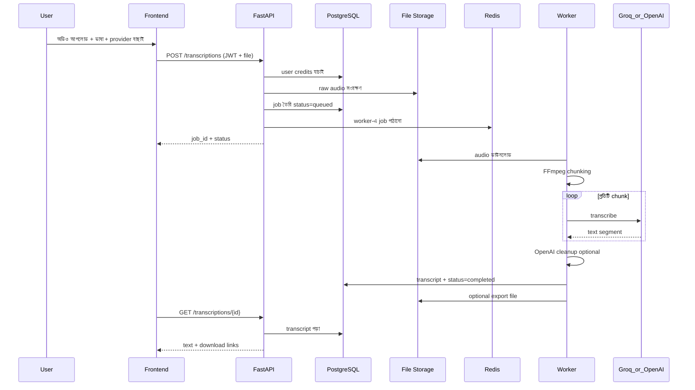
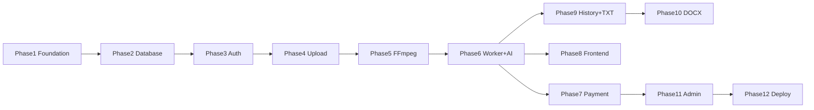

# Transcribe Pro — সম্পূর্ণ প্রফেশনাল আর্কিটেকচার ও মাইগ্রেশন প্ল্যান

> **মাইগ্রেশন প্রজেক্ট** — নতুন অ্যাপ আইডিয়া নয়। `[legacy_reference/app.py](legacy_reference/app.py)` শুধু **প্রমাণিত ট্রান্সক্রিপশন লজিকের রেফারেন্স**। `legacy_reference/` স্পর্শ করা যাবে না।

---

## ১. সম্পূর্ণ সিস্টেম আর্কিটেকচার




### ডেটা ফ্লো — একটি ট্রান্সক্রিপশন জব




### মূল ডোমেইন ধারণা


| ধারণা                | ব্যাখ্যা                                                                  |
| -------------------- | ------------------------------------------------------------------------- |
| **User**             | লগইন করা ব্যবহারকারী                                                      |
| **Credit / Coin**    | প্রতি ট্রান্সক্রিপশনে খরচ — legacy-র `APP_ACCESS_CODE` এর পেশাদারি বিকল্প |
| **TranscriptionJob** | একটি অডিও প্রসেসিং কাজ — `queued → processing → completed / failed`       |
| **Transcript**       | চূড়ান্ত টেক্সট + metadata (ভাষা, provider, duration)                     |
| **AudioFile**        | storage-এ raw + chunked ফাইলের path                                       |
| **UsageLog**         | admin/analytics — API calls, minutes processed, cost                      |


---

## ২. প্রস্তাবিত টেক স্ট্যাক


| স্তর                 | প্রযুক্তি                                                                                     | কেন                                                            |
| -------------------- | --------------------------------------------------------------------------------------------- | -------------------------------------------------------------- |
| **Frontend**         | Next.js 14+ (App Router), TypeScript, Tailwind CSS                                            | প্রোডাকশন SaaS-এর জন্য পরিচিত, SEO + auth UI সহজ               |
| **Backend API**      | FastAPI, Python 3.11                                                                          | আপনার লিগ্যাসি Python লজিক (FFmpeg, OpenAI SDK) সরাসরি ব্যবহার |
| **Auth**             | JWT (access + refresh), `passlib` + `bcrypt`, optional OAuth পরে                              | স্ট্যান্ডার্ড, self-hosted, DB-এ user table                    |
| **Database**         | PostgreSQL 15+                                                                                | relational data — users, jobs, credits, history                |
| **ORM**              | SQLAlchemy 2.0 + Alembic migrations                                                           | প্রোডাকশন DB পরিবর্তন নিয়ন্ত্রণ                               |
| **File Storage**     | S3-compatible (AWS S3 / Cloudflare R2); local MinIO dev-এ                                     | স্কেলেবল; সার্ভার ডিস্কে বড় ফাইল রাখা ঠিক নয়                 |
| **Background Jobs**  | Celery + Redis                                                                                | দীর্ঘ অডিও — API দ্রুত response, worker পেছনে কাজ              |
| **Audio Processing** | FFmpeg + ffprobe (`subprocess`)                                                               | লিগ্যাসি থেকে প্রমাণিত                                         |
| **Transcription**    | Groq (`whisper-large-v3-turbo`), OpenAI (`gpt-4o-transcribe-diarize` + `gpt-4o-mini` cleanup) | লিগ্যাসি থেকে                                                  |
| **Payment**          | Stripe (Checkout + webhooks)                                                                  | coin/credit কেনার জন্য ইন্ডাস্ট্রি স্ট্যান্ডার্ড               |
| **Export**           | `python-docx` (Phase 10), plain TXT (Phase 9)                                                 | পরে                                                            |
| **Admin**            | FastAPI admin routes + সহজ internal dashboard (Phase 11)                                      | usage tracking                                                 |
| **Deployment**       | Docker + docker-compose; পরে Railway / Render / AWS                                           | একই structure dev ও prod-এ                                     |
| **Config**           | `pydantic-settings` + `.env`                                                                  | লিগ্যাসির `dotenv` ধারণা, কিন্তু টাইপড                         |


**লিগ্যাসি থেকে রাখা হবে না (প্রথম সংস্করণে):** Local `faster-whisper` — CPU-heavy; পরে optional provider হিসেবে যোগ করা যাবে।

---

## ৩. Monorepo না আলাদা ফোল্ডার?

### সিদ্ধান্ত: **একটি repo-তে multi-folder monorepo**

কারণ: ছোট/মাঝারি টিম, এক জায়গায় deploy config, shared types পরে। `legacy_reference/` root-এ অপরিবর্তিত।

```
transcribe-pro-backend/                    # repo root (নাম পরে transcribe-pro হতে পারে)
│
├── legacy_reference/                      # ❌ স্পর্শ করবেন না — শুধু রেফারেন্স
│   ├── app.py
│   ├── requirements.txt
│   ├── packages.txt
│   └── runtime.txt
│
├── apps/
│   ├── api/                               # FastAPI — মূল API সার্ভার
│   │   ├── app/
│   │   │   ├── main.py
│   │   │   ├── api/routes/
│   │   │   ├── core/                      # config, security, logging
│   │   │   ├── db/                        # session, base model
│   │   │   ├── models/                    # SQLAlchemy models
│   │   │   ├── schemas/                   # Pydantic request/response
│   │   │   ├── services/                  # business logic
│   │   │   └── dependencies/              # FastAPI Depends
│   │   ├── alembic/                       # DB migrations (Phase 2)
│   │   ├── tests/
│   │   ├── requirements.txt
│   │   └── Dockerfile
│   │
│   ├── worker/                            # Celery worker (Phase 6)
│   │   ├── worker/
│   │   │   ├── celery_app.py
│   │   │   └── tasks/
│   │   ├── requirements.txt               # api-র services share করবে
│   │   └── Dockerfile
│   │
│   └── web/                               # Next.js frontend (Phase 8)
│       ├── src/
│       ├── package.json
│       └── Dockerfile
│
├── packages/
│   └── shared/                            # optional — shared constants/types
│
├── infra/
│   ├── docker/
│   │   ├── docker-compose.yml             # api + worker + postgres + redis + minio
│   │   └── docker-compose.dev.yml
│   └── scripts/
│       └── init-minio.sh
│
├── docs/
│   └── architecture.md
│
├── .env.example                           # root — সব সার্ভিসের env এক জায়গায়
├── .gitignore
└── README.md
```

**কেন `apps/api/app/` nested?** FastAPI কনভেনশন + Docker-এ `uvicorn app.main:app` সহজ। Worker পরে `apps/api/app/services` import করবে — কোড ডুপ্লিকেট নয়।

---

## ৪. পুরনো `app.py` থেকে কী আসবে


| লিগ্যাসি অংশ                             | নতুন জায়গা                                        | নোট                                 |
| ---------------------------------------- | -------------------------------------------------- | ----------------------------------- |
| `WHISPER_LANGUAGES` dict                 | `app/core/languages.py`                            | API validation + frontend dropdown  |
| `get_audio_duration_seconds()`           | `app/services/audio/ffmpeg.py`                     | ffprobe — সরাসরি লজিক reuse         |
| `create_safe_audio_chunks_with_ffmpeg()` | `app/services/audio/ffmpeg.py`                     | 24MB limit, 30min→half segment      |
| `SAFE_CHUNK_SIZE_MB = 24`                | `app/core/constants.py`                            | config-এ override যোগ্য             |
| OpenAI transcription kwargs              | `app/services/transcription/openai_provider.py`    | model, diarized_json, language      |
| OpenAI cleanup prompt                    | `app/services/transcription/cleanup.py`            | optional `cleanup=true`             |
| Groq client + transcription              | `app/services/transcription/groq_provider.py`      | base_url + whisper-large-v3-turbo   |
| Supported file types                     | `app/schemas/transcription.py` + upload validation | mp3, mp4, m4a, wav...               |
| TXT output `{name}.txt`                  | `app/services/export/txt.py`                       | Phase 9                             |
| `APP_ACCESS_CODE` ধারণা                  | → User auth + credit system                        | সরল gate নয়, account-based         |
| `OPENAI_API_KEY`, `GROQ_API_KEY`         | `app/core/config.py`                               | server-side only, কখনো client-এ নয় |
| `packages.txt` → ffmpeg                  | Docker image + worker image                        | সিস্টেম dependency                  |
| `runtime.txt` → Python 3.11              | সব Python সার্ভিস                                  |                                     |


---

## ৫. কী **পুনর্বিন্যাস** করতে হবে (কপি নয়)


| লিগ্যাসি                           | নতুন ডিজাইন                                                        |
| ---------------------------------- | ------------------------------------------------------------------ |
| এক ফাইল `app.py`                   | layered: routes → services → providers → storage                   |
| Streamlit UI                       | Next.js frontend + REST API                                        |
| `st.file_uploader`                 | `POST /api/v1/transcriptions` multipart + presigned URL option পরে |
| `st.audio_input` (মাইক্রোফোন)      | ব্রাউজার রেকর্ড → frontend blob → upload API                       |
| তিনটি button (OpenAI/Groq/Whisper) | `provider: "openai"                                                |
| `st.session_state processing`      | `TranscriptionJob.status` in DB + polling/WebSocket                |
| সিঙ্ক্রোনাস loop (user অপেক্ষা)    | API তৎক্ষণাৎ `job_id` দেয়; worker প্রসেস করে                      |
| `tempfile.mkdtemp()`               | S3/local storage + job-scoped temp cleanup                         |
| `st.download_button`               | `GET /transcriptions/{id}/export?format=txt`                       |
| `st.secrets`                       | `.env` + pydantic Settings                                         |
| Access code একটাই সবার জন্য        | per-user JWT + credit balance                                      |
| Local Whisper `@st.cache_resource` | optional worker-only provider পরে                                  |
| কোনো persistence নেই               | PostgreSQL — history, billing, audit                               |


---

## ৬. বাস্তবায়নের ধাপ (Implementation Phases)

ধাপে ধাপে — **একসাথে সব কোড নয়**।


| Phase  | নাম                               | কী বানাবে                                                                                                       | নির্ভরতা |
| ------ | --------------------------------- | --------------------------------------------------------------------------------------------------------------- | -------- |
| **1**  | Backend Foundation                | FastAPI scaffold, config, health, logging, CORS stub, folder structure, docker-compose skeleton, `.env.example` | —        |
| **2**  | Database Core                     | PostgreSQL, SQLAlchemy, Alembic, models: User, TranscriptionJob, Transcript, CreditLedger                       | Phase 1  |
| **3**  | Authentication                    | register, login, JWT refresh, password hash, protected routes                                                   | Phase 2  |
| **4**  | File Upload + Storage             | upload endpoint, MinIO/S3 adapter, file validation, job record `queued`                                         | Phase 3  |
| **5**  | FFmpeg Service                    | legacy chunking logic port, duration check, unit tests                                                          | Phase 4  |
| **6**  | Background Worker + Transcription | Celery, Redis, Groq + OpenAI providers, job lifecycle, error handling                                           | Phase 5  |
| **7**  | Credit / Coin + Stripe            | credit deduct per job, Stripe checkout, webhook top-up                                                          | Phase 6  |
| **8**  | Frontend MVP                      | upload UI, language/provider select, job status, transcript view                                                | Phase 6  |
| **9**  | Transcript History + TXT Export   | list/history API, download TXT                                                                                  | Phase 6  |
| **10** | DOCX Export                       | `python-docx` export endpoint                                                                                   | Phase 9  |
| **11** | Admin + Usage Tracking            | admin routes, usage logs, dashboards                                                                            | Phase 7  |
| **12** | Production Hardening              | CI/CD, monitoring, rate limits, backup, cloud deploy                                                            | Phase 11 |





---

## ৭. প্রথম ধাপ — ঠিক কী বানাবেন (Phase 1)

### লক্ষ্য

Production-style **ভিত্তি** যা পরের সব phase-এর সাথে মিলে যায় — কিন্তু **এখনো implement করবেন না:** DB, auth, upload, transcription, payment, worker, frontend।

### Phase 1-এ যা **থাকবে**

- `apps/api/` FastAPI অ্যাপ চালু
- `GET /health` এবং `GET /api/v1/health` (versioned API pattern শুরু থেকে)
- `app/core/config.py` — pydantic-settings; ভবিষ্যত env key-গুলো documented কিন্তু unused
- `app/core/logging.py` — structured logging
- `app/api/router.py` — central router (খালি sub-routers mount করার জায়গা)
- খালি package folders: `db/`, `models/`, `schemas/`, `services/`, `dependencies/` (`__init__.py` only)
- `infra/docker/docker-compose.yml` — postgres, redis, minio **commented/stub** অথবা `profiles: ["full"]` দিয়ে optional
- Root `.env.example`, `.gitignore`, `README.md`
- `apps/api/Dockerfile` — multi-stage, ffmpeg install comment/stub for Phase 5

### Phase 1-এ যা **থাকবে না**

- কোনো database connection
- কোনো auth endpoint
- কোনো file upload
- কোনো Celery worker চালানো
- `legacy_reference/` পরিবর্তন

### যাচাই (acceptance criteria)

1. `uvicorn app.main:app --reload` → `http://127.0.0.1:8000/api/v1/health` → `{"status":"ok","version":"0.1.0"}`
2. `http://127.0.0.1:8000/docs` — Swagger UI খোলে
3. Config `.env` থেকে `APP_NAME`, `DEBUG` পড়ে
4. Folder structure Phase 2–12 এর জন্য প্রস্তুত

---

## ৮. Phase 1-এ তৈরি হবে এমন ফাইলগুলোর তালিকা

```
transcribe-pro-backend/
├── .env.example
├── .gitignore
├── README.md
│
├── docs/
│   └── architecture.md              # এই প্ল্যানের সংক্ষিপ্ত সংস্করণ
│
├── infra/
│   └── docker/
│       └── docker-compose.yml       # api service + commented postgres/redis/minio
│
└── apps/
    └── api/
        ├── Dockerfile
        ├── requirements.txt
        ├── tests/
        │   ├── __init__.py
        │   └── test_health.py
        └── app/
            ├── __init__.py
            ├── main.py              # FastAPI app, lifespan stub, CORS, router mount
            ├── api/
            │   ├── __init__.py
            │   ├── router.py          # api_v1_router
            │   └── routes/
            │       ├── __init__.py
            │       └── health.py
            ├── core/
            │   ├── __init__.py
            │   ├── config.py        # Settings class — সব future env documented
            │   └── logging.py
            ├── db/
            │   └── __init__.py      # খালি — Phase 2
            ├── models/
            │   └── __init__.py      # খালি — Phase 2
            ├── schemas/
            │   ├── __init__.py
            │   └── health.py        # HealthResponse model
            ├── services/
            │   └── __init__.py      # খালি — Phase 4+
            └── dependencies/
                └── __init__.py      # খালি — Phase 3
```

**মোট:** ~২২টি ফাইল (বেশিরভাগ ছোট scaffold)। `legacy_reference/` — **০ পরিবর্তন**।

### `requirements.txt` (Phase 1 শুধু)

```
fastapi>=0.111.0
uvicorn[standard]>=0.30.0
pydantic-settings>=2.3.0
python-dotenv>=1.0.1
httpx>=0.27.0          # tests-এর জন্য
pytest>=8.0.0
```

---

## সারাংশ — আপনার ১৪টি দাবি ম্যাপিং


| দাবি                    | কোন Phase                             |
| ----------------------- | ------------------------------------- |
| 1. Frontend             | Phase 8                               |
| 2. FastAPI backend      | Phase 1 শুরু, Phase 6 পরিপূর্ণ        |
| 3. User login/auth      | Phase 3                               |
| 4. Payment/coin         | Phase 7                               |
| 5. Database             | Phase 2                               |
| 6. File storage         | Phase 4                               |
| 7. Background worker    | Phase 6                               |
| 8. Groq transcription   | Phase 6 (legacy logic)                |
| 9. OpenAI transcription | Phase 6 (legacy logic)                |
| 10. FFmpeg chunking     | Phase 5 (legacy logic)                |
| 11. Transcript history  | Phase 9                               |
| 12. TXT/DOCX export     | Phase 9 / 10                          |
| 13. Admin/usage         | Phase 11                              |
| 14. Deployment-ready    | Phase 1 skeleton + Phase 12 hardening |


---

**পরবর্তী পদক্ষেপ:** আপনি এই প্ল্যান **অনুমোদন** করলে শুধু **Phase 1** এর ফাইল তৈরি করা হবে — অন্য কিছু নয়।